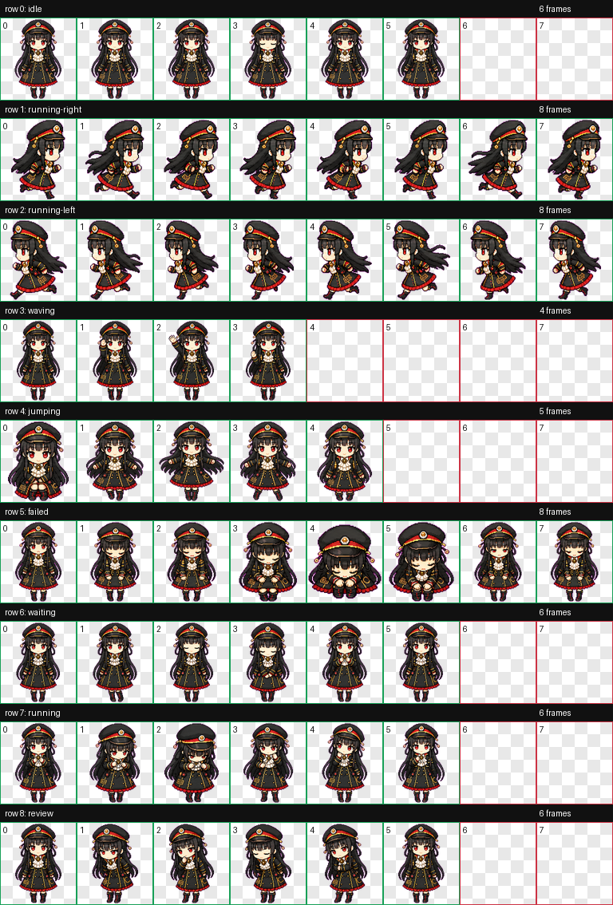

# Hachiroku Codex Pet

[中文](README.zh-CN.md) | [日本語](README.ja.md)

An unofficial fan-made Codex pet inspired by Hachiroku from Maitetsu.

## Preview



This pet includes a Codex-compatible animated spritesheet with the following states:

- idle
- running-right
- running-left
- waving
- jumping
- failed
- waiting
- running
- review

## Install

Clone or download this repository, then place the `hachiroku` folder under your Codex pets directory:

```bash
mkdir -p ~/.codex/pets
cp -R hachiroku ~/.codex/pets/
```

The final structure should be:

```text
~/.codex/pets/hachiroku/
  pet.json
  spritesheet.webp
```

Restart or refresh Codex, then select the Hachiroku pet from the pet picker.

## Files

- `hachiroku/pet.json`: Codex pet manifest.
- `hachiroku/spritesheet.webp`: 8 x 9 Codex pet animation atlas.

## Disclaimer

This is an unofficial fan-made Codex pet. Hachiroku, Maitetsu, and related original works belong to their respective rights holders.

This repository is not affiliated with or endorsed by the original creators or rights holders.

The included pet spritesheet is provided for personal, non-commercial use only.
